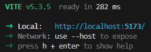

# Social Media App (similar to Twitter)

A social media app inspired by Twitter. It is a full stack web application that uses various web technologies for it's implementation.

## Table of Contents

- [Features](#features)
- [Technologies Used](#technologies-used)
- [Prerequisite](#prerequisite)
- [Installation](#installation)
<!-- - [Usage](#usage)
- [Project Structure](#project-structure)
- [License](#license) -->

## Features

- User can create an account and existing users can login to their account.
- User can create post, it can be only text or with a photo.
- User can edit their posts after publishing.
- User can like and comment to other posts posted by other users.
- Users can check their own profile and other peoples profile as well.

## Technologies Used

**Frontend**:

- **Core:** HTML, CSS, JavaScript
- **Library:** React.js

**Backend**:

- **Core:** Node.js
- **Framework:** Express.js

**Database**

- MongoDB Atlas

## Prerequisite

1. `Node.js`
2. `Express.js`
3. `React`
4. `MongoDB Atlas` account
5. **IDE:** `Visual Studio Code` (Recommend) or any other as per your choice.
6. (Optional) `Postman` For API testing

## Installation

### Follow the step-by-step procedure for your local development setup:

**Clone the repository:**
First, clone the repository, for any help or step-by-step procedure on how to clone a repository please check out this article:
https://docs.github.com/en/repositories/creating-and-managing-repositories/cloning-a-repository

**Intermediate Steps:**
After cloning or downloading the project in your terminal change the current directory to the project folder.
By running the following command, [note: if you are using VS code then you can skip this part just press ``ctrl+ `(backtick)`` to open the terminal within VS code]

```bash
cd your-local-path/social-media-app
```

**Main Setup:**
There are 2 individual setups required:

1. [Frontend](#client-setup)
2. [Backend](#server-setup)

### Client Setup

For setting up the frontend part, you need to install some packages. Before that make sure to change the directory in your terminal,

```bash
cd client
```

Then run the following command,

```bash
npm install
```

This will install all the necessary packages. After all packages are downloaded and installed successfully run the following command,

```bash
npm run dev
```

If everything is good then you should see:



### Server Setup:

Before you do anything in the server setup, you need to set up the `.env` file. The `.env` file should contain 3 things for at least now,

1. `MONGO_URI`
2. `JWT_SECRET`
3. `JWT_LIFESPAN`

The `MONGO_URI` is your `MongoDB atlas` database connection string.
The `JWT_SECRET` contains an Encryption key, you need to create an Encryption key 256bit. You can use this website for the key generation: https://acte.ltd/utils/randomkeygen.
You can set `JWT_LIFESPAN` as long as you want but `30d` is recommended.

After setting all this up, again make sure to change the directory in your terminal,

```bash
cd server
```
After changing the directory, run the following command,

```bash
npm install
```
This will install all the necessary packages. Then you can start the server by running the following command,

```bash
npm start
```

If you can see a log in the terminal that says,

```bash
Server is listening on port 3000...
```

you are good to go, if not then troubleshoot. Good luck 🍀.
